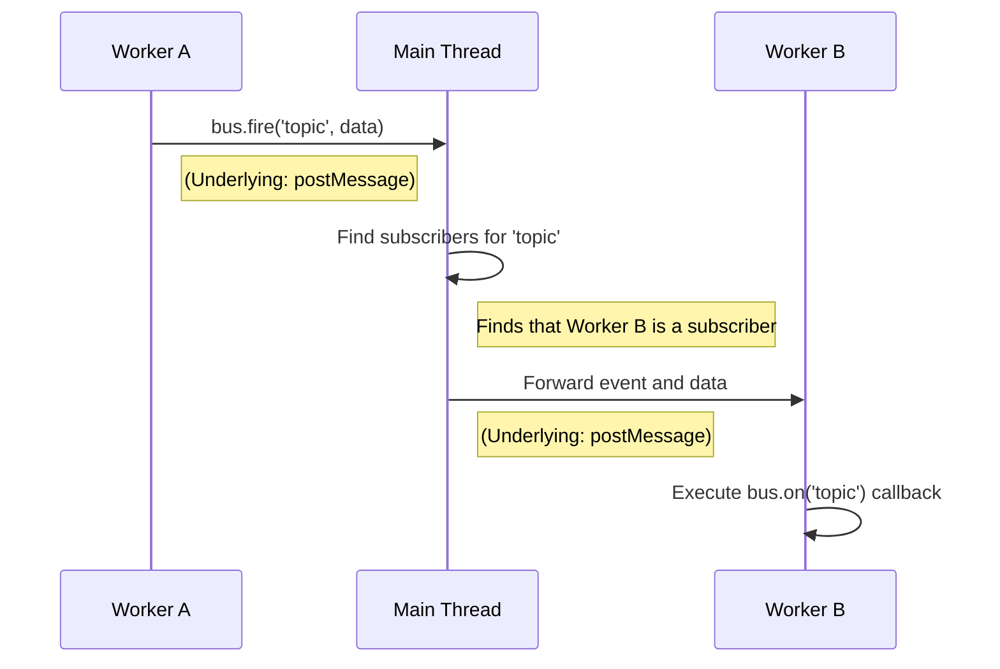

# dxEventBus: A Thread-Safe Event Bus

---

## Introduction

As mentioned in the `Worker` [Overview](./overview.md), DejaOS recommends using `dxEventBus` as the standard method for communication between `Worker`s. `dxEventBus` is a global event bus based on the **publish/subscribe pattern**. It is built on top of QuickJS's native `postMessage` mechanism but provides a higher-level, more decoupled abstraction, making it the preferred choice for building complex multi-threaded applications.

**Core Advantages:**

- **Complete Decoupling**: Communicating parties do not need to hold references to each other; they only need to agree on an event name (`topic`) to communicate.
- **Unified Architecture**: The same `bus.on`/`bus.fire` API is used for communication between the main thread and a `Worker`, or between `Worker`s, forming a unified event-driven architecture.
- **Flexible Patterns**: It can easily implement various communication patterns such as one-to-one and one-to-many (broadcast).

---

## Core Mechanism: Main Thread Forwarding

The design of `dxEventBus` follows the underlying communication mechanism of QuickJS Workers, the core of which is: **the main thread must act as a hub for all cross-thread events**. This is determined by the QuickJS `Worker` model, as `Worker`s cannot communicate directly with each other; all messages must be sent and received through the main thread. `dxEventBus` provides an elegant wrapper around this.

When a `Worker` calls `bus.fire()`, the event is not sent directly to another `Worker`. Instead, it goes through the following process:

1.  `Worker A` sends the event to the **main thread** via `postMessage`.
2.  The **main thread** receives the event and looks up all subscribers for that event in its internal subscriber list.
3.  If the **main thread** finds that `Worker B` has subscribed to the event, it forwards the event to `Worker B` via `postMessage` again.
4.  `Worker B` receives the message forwarded from the main thread and finally executes the corresponding callback function.



:::danger Performance Considerations
Understanding this core mechanism is crucial. It means that **all communication between `Worker`s goes through the main thread and incurs the overhead of two `postMessage` calls (Worker A -> Main -> Worker B)**. Therefore, it is very suitable for decoupling business logic and for status notifications, but for raw data exchange scenarios that require extremely low latency and high throughput, `dxMap`, which will be introduced in a later document, might be a better choice.
:::

---

## Basic API

The API of `dxEventBus` is very simple and intuitive.

- `bus.on(topic, callback)`: Subscribes to an event. When any thread fires an event with this `topic`, the `callback` function will be executed.
  :::info Note
  Within the same thread (main thread or a specific Worker), if `bus.on` is called multiple times for the same `topic`, **the new callback function will overwrite the old one**. Each `topic` corresponds to only one handler function within a single thread.
  :::
- `bus.fire(topic, data)`: Fires an event. `topic` is the event name, and `data` is the data object you want to pass.
- `bus.off(topic)`: Unsubscribes the current thread from an event.
- `bus.newWorker(id, file)`: (Main thread only) Creates a `Worker` and automatically includes it in the `dxEventBus` management system.
  - `id` String: A unique identifier for the Worker. It must be **globally unique** and cannot be repeated.
  - `file` String: The **absolute path** to the Worker's entry script. The DejaOS `Worker` model requires the code to be pre-written in a JS file and then loaded by path; code cannot be dynamically injected after creation.

:::danger Important
To ensure that `Worker`s can be correctly managed by the event bus, **you must use `bus.newWorker()` to create threads**, not the native QuickJS `new Worker()`. `Worker`s created with the native interface will be outside the `dxEventBus` system and will not be able to receive or send bus events.
:::

---

## Usage Examples

### 1. Main Thread and Worker Communication

This is the most common scenario. The main thread dispatches tasks to a `Worker`, and the `Worker` notifies the main thread upon completion.

**`main.js` (Main Thread)**

```javascript
import bus from "./dxmodules/dxEventBus.js";
import log from "./dxmodules/dxLogger.js";

log.info("Main thread started.");

// 1. Create and start a worker using bus.newWorker
bus.newWorker("task-worker", "/app/code/worker.js");

// 2. Listen for the completion event from the worker
bus.on("task-complete", (result) => {
  log.info("[Main] Received result from worker:", result);
  // You can update the UI or perform other actions here
});

// 3. Dispatch a task to the worker after 200ms
setTimeout(() => {
  log.info("[Main] Firing start-task event to worker...");
  bus.fire("start-task", { seconds: 5 });
}, 200);
```

**`worker.js` (Worker Thread)**

```javascript
import bus from "./dxmodules/dxEventBus.js";
import log from "./dxmodules/dxLogger.js";

log.info(`[Worker ${bus.id}] started and is ready.`);

// 1. Listen for the task event from the main thread
bus.on("start-task", (task) => {
  log.info(`[Worker] Received task: wait for ${task.seconds} seconds.`);

  // Simulate a time-consuming operation
  setTimeout(() => {
    const result = { status: "done", processedIn: bus.id };
    log.info("[Worker] Task finished, firing task-complete event...");
    // 2. Task completed, fire an event to notify the main thread
    bus.fire("task-complete", result);
  }, task.seconds * 1000);
});
```

### 2. Communication Between Workers

As described in the core mechanism, this communication is **done indirectly through the main thread**.

**`main.js` (Main Thread)**

```javascript
import bus from "./dxmodules/dxEventBus.js";
import log from "./dxmodules/dxLogger.js";

// Create two workers
bus.newWorker("worker-A", "/app/code/workerA.js");
bus.newWorker("worker-B", "/app/code/workerB.js");

log.info("[Main] worker-A and worker-B have been started.");
// The main thread only starts them and then acts as an event forwarding hub, no extra code is needed.
```

**`workerA.js`**

```javascript
import bus from "./dxmodules/dxEventBus.js";
import log from "./dxmodules/dxLogger.js";

// After 3 seconds, send a message to worker-B
setTimeout(() => {
  log.info("[Worker-A] Firing event to worker-B...");
  bus.fire("data-for-b", { message: "Hello from Worker A!" });
}, 3000);
```

**`workerB.js`**

```javascript
import bus from "./dxmodules/dxEventBus.js";
import log from "./dxmodules/dxLogger.js";

// Listen for the event from worker-A
bus.on("data-for-b", (data) => {
  log.info(`[Worker-B] Received data: "${data.message}"`);
});
```

### 3. Intra-Worker Communication

`dxEventBus` can also be used as a regular event emitter within a single `Worker` to decouple different logical modules inside the `Worker`.

:::tip
Although possible, this is usually not necessary. Direct function calls are often simpler and more efficient within a single thread. This usage should only be considered when you need to deeply decouple complex modules within a `Worker`.
:::

**`some-worker.js`**

```javascript
import bus from "./dxmodules/dxEventBus.js";
import log from "./dxmodules/dxLogger.js";

// Module B is responsible for listening
function moduleB() {
  bus.on("internal-notification", (data) => {
    log.info(`[Module B] Received internal event: ${data.info}`);
  });
}

// Module A is responsible for firing
function moduleA() {
  log.info("[Module A] Firing internal event...");
  bus.fire("internal-notification", { info: "Something happened in Module A" });
}

// Initialize
moduleB();
moduleA();
```
